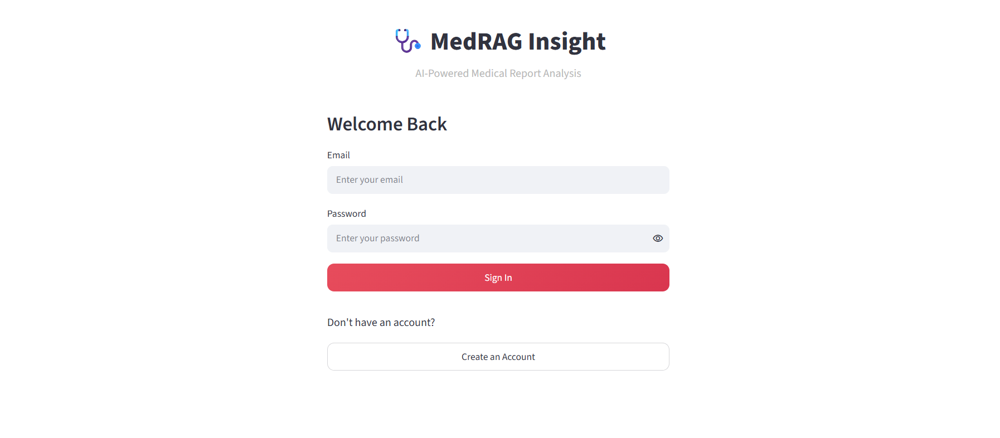
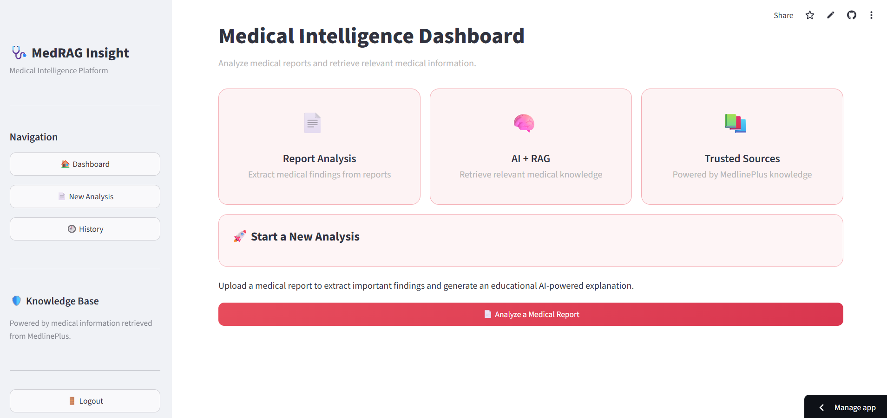
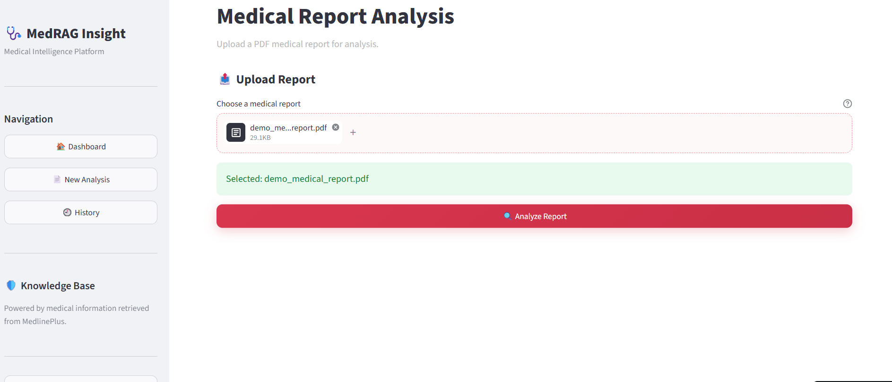
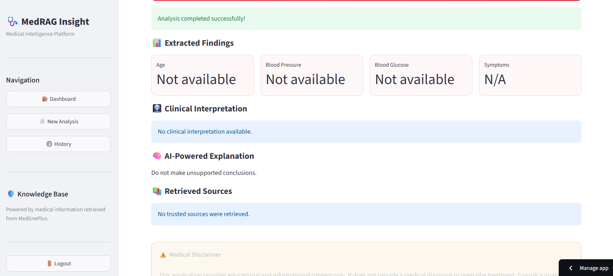

# 🩺 MedRAG Insight

> **AI-Powered Medical Report Analysis using Retrieval-Augmented Generation (RAG)**

[](YOUR_STREAMLIT_CLOUD_URL_HERE)
[](https://www.python.org/)
[](https://streamlit.io/)
[](#how-it-works)

## 🔗 Live Demo

👉 **Streamlit Cloud:** [Open MedRAG Insight](https://medrag-insight-3zqtak5gy2jugp6w7cgsxt.streamlit.app/)

> Replace `YOUR_STREAMLIT_CLOUD_URL_HERE` with your Streamlit Community Cloud URL.

---

## 📌 Project Overview

**MedRAG Insight** is an AI-powered medical report analysis application designed to help users understand information contained in medical reports in a clear and educational way.

Users can upload a **PDF medical report**, extract relevant findings, retrieve related medical information from a trusted knowledge base, and view an AI-powered explanation through a professional Streamlit interface.

The project combines **NLP, vector search, Retrieval-Augmented Generation (RAG), and AI-based explanation** to create a grounded medical information assistant.

### ⚠️ Important

MedRAG Insight is an **educational and informational assistant**, not an autonomous doctor. It does **not** provide medical diagnosis, prescribe treatment, or replace a qualified healthcare professional.

---

## ✨ Key Features

- 📄 Medical PDF upload
- 🔍 Medical report text extraction and finding analysis
- 🧠 AI + Retrieval-Augmented Generation (RAG)
- 🔎 Semantic vector search using FAISS
- 📚 Medical knowledge retrieval from MedlinePlus
- 📊 Extracted findings such as age, blood pressure, blood glucose, and symptoms
- 🩻 Clinical interpretation section
- 💬 AI-powered grounded explanation
- 🕘 Session-based analysis history
- 🎨 Professional Streamlit dashboard
- ⚠️ Built-in medical safety disclaimer

---

## 🛠️ Technologies Used

| Technology | Purpose |
|---|---|
| **Python** | Core programming language |
| **Streamlit** | Web application and UI |
| **FAISS** | Vector similarity search |
| **RAG** | Grounded knowledge retrieval |
| **NLP** | Medical text processing |
| **MedlinePlus** | Trusted medical knowledge source |
| **PDF Processing** | Medical report text extraction |
| **Vector Embeddings** | Semantic representation and retrieval |

---

## 🧠 How It Works

```text
Medical PDF Report
       │
       ▼
PDF Text Extraction
       │
       ▼
Finding Extraction
(Age / BP / Glucose / Symptoms)
       │
       ▼
RAG Query Creation
       │
       ▼
FAISS Vector Search
       │
       ▼
Medical Knowledge Retrieval
from MedlinePlus
       │
       ▼
AI-Powered Grounded Explanation
```

### Workflow

1. The user uploads a medical report in PDF format.
2. The application extracts text from the report.
3. Relevant findings are identified and displayed.
4. Queries are created from the extracted information.
5. FAISS searches the vector store for relevant medical knowledge.
6. Relevant information from the knowledge base is retrieved.
7. The application presents an educational AI-powered explanation.
8. The analysis is stored in the current session's history.

---

## 📁 Project Structure

```text
MedRAG-Insight/
│
├── app.py
├── backend.py
├── requirements.txt
├── README.md
│
├── medical_documents/
│   └── medlineplus_*.txt
│
├── vector_store/
│   ├── medlineplus_embeddings.*
│   └── medlineplus_index.*
│
├── sample_medical_report.pdf
│
├── screenshots/
│   ├── 01-signin.jpg
│   ├── 02-dashboard.jpg
│   ├── 03-new-analysis.jpg
│   ├── 04-analysis-results.jpg
│   └── 05-history.jpg
│
└── ...
```

> Add your History screenshot later as `screenshots/05-history.jpg`.

---

## 🖥️ Application Screenshots

### 1. Sign In



### 2. Medical Intelligence Dashboard



### 3. Medical Report Upload & Analysis



### 4. AI-Powered Analysis Results



### 5. Analysis History

[Analysis History](screenshots/Screenshot 2026-09-16 000310.png)

---

## 🚀 Run Locally

### 1. Clone the repository

```bash
git clone YOUR_GITHUB_REPOSITORY_URL
cd MedRAG-Insight
```

### 2. Create a virtual environment

```bash
python -m venv venv
```

On Windows:

```bash
venv\Scripts\activate
```

### 3. Install dependencies

```bash
pip install -r requirements.txt
```

### 4. Run the application

```bash
streamlit run app.py
```

---

## ☁️ Deployment

MedRAG Insight can be deployed using **Streamlit Community Cloud**.

1. Push the project to GitHub.
2. Connect the repository to Streamlit Community Cloud.
3. Select `app.py` as the main application file.
4. Deploy the application.
5. Copy the generated Streamlit URL into the **Live Demo** section above.

---

## 🔐 Medical Safety & Responsible AI

MedRAG Insight is designed as a **grounded medical information assistant**.

The system should:

- Avoid unsupported medical conclusions.
- Avoid claiming a definitive diagnosis.
- Avoid prescribing medication or treatment.
- Use retrieved medical information to support explanations.
- Clearly communicate uncertainty and limitations.
- Encourage users to consult qualified healthcare professionals.

### Medical Disclaimer

> **Medical Disclaimer:** This application provides educational and informational content only. It does not provide medical diagnosis, prescribe treatment, or replace professional medical advice. Always consult a qualified healthcare professional for medical decisions.

---

## 🎯 Project Goals

The main goals of this project are to:

- Demonstrate a practical RAG-based AI application.
- Apply NLP to medical documents.
- Combine document processing with semantic search.
- Implement vector-based knowledge retrieval.
- Generate grounded AI explanations.
- Build a professional AI/ML portfolio project.

---

## 🔮 Future Improvements

- 🖼️ Support for medical report images
- 📑 Support for additional document formats
- 🔎 Improved medical entity and finding extraction
- 🧠 Advanced embedding and retrieval models
- 📚 More trusted medical knowledge sources
- 👤 Persistent user authentication
- 🕘 Persistent database-backed analysis history
- 📊 More detailed report visualizations
- 🌐 Multi-language explanations
- 🔐 Improved privacy and secure document handling

---

## 👨‍💻 Author

**Sukendu Shit**

Computer Science & Engineering | AI/ML

- GitHub: https://github.com/shitsukendu
- LinkedIn: https://linkedin.com/in/sukendu-shit-825203283/

---

## ⭐ Support

If you find **MedRAG Insight** useful or interesting, consider giving the repository a ⭐ on GitHub.

---

**MedRAG Insight — Grounded medical information through AI + RAG.**
